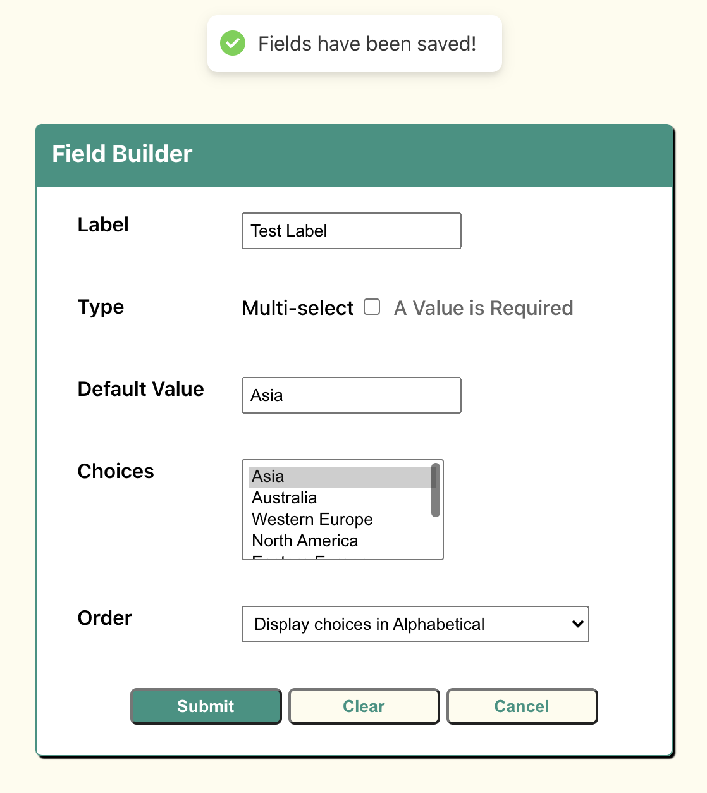

# UI Interview Demo

This repo represents my quick take on the UI craft demo design requirements.
The work was completed with React and custom CSS.

This project was bootstrapped with [Create React App](https://github.com/facebook/create-react-app).

#### Project Status
+ Base form created with HTML elements
+ Created FieldBuilder React functional component with initial useState and useEffect hooks
+ Applied custom css to match UI design concept. Included some unique takes on the design, including making use
of the new Quickbase color scheme
+ Integrated given MockService.js file with fetch POST request
+ Applied flexbox containers to allow the form to be moderately responsive to changes in screen size
+ Made use of third party library to display toast messages as feedback for user submission and clearing of form

#### Available Scripts

From the front-end-craft-demo folder, you can run:

##### `yarn start`

Runs the app in the development mode.\
Open [http://localhost:3000](http://localhost:3000) to view it in the browser.

The page will reload if you make edits.\
You will also see any lint errors in the console.

